# GreenHatDecorator

Decorate your contribution table.

借鉴于 angusshire https://github.com/angusshire/greenhat
inspired form angusshire https://github.com/angusshire/greenhat

这是一个用来装饰你的contribution table 的一个小工具。现在你可以随心所欲在contribution table上创建你想要的图案。
即便你搞砸了一切，也没关系，只需要删掉相应的repository就可以恢复如初。

This is a widget to decorate your Contribution Table. You can now create any pattern or icon you want on the Contribution Table.
If you mess up, you can simply delete the repository to recovery it.

包含一个py 和 基于JS 的 web.
It contains one py file and a web UI based on js.

目前只支持windows用户。
需要安装git，和环境变量。确保在cmd中可以运行git命令：

Currently only support Windows.
You need to install Git, and make sure git commands can be run in CMD:

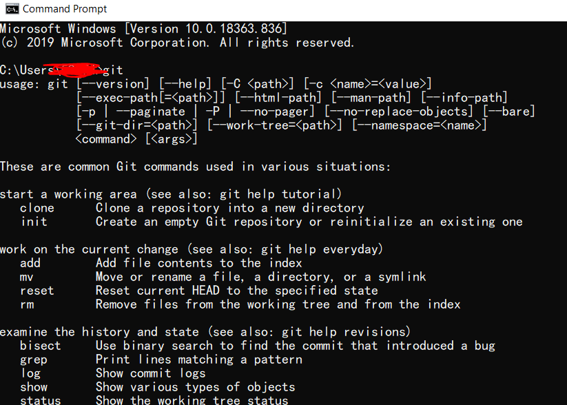

将py文件放入你的repository 文件夹！

Put py file into your repository folder.

原理是通过web定制你想要的图案，web将会生成一个date.txt
其中包含了commit的日期和commit的次数，然后使用py读取改文件，并按照文件中的日期和次数进行commit。

The theory is that by customizing the pattern you want from the Web, the Web will generate a date.txt
whcih contains the date for commit and a number represents the commit times on that date. Then reads the date.txt through py file, and make commit according to the date.txt.

# 使用说明 Instructions

## 在空白页面添加图案 add pattern on blank table

如图现在我的contribution table没有2019年，我将会把图案写入2019年：

You can see now my contribution table doesn't contain 2019, and I will write my pattern into 2019.

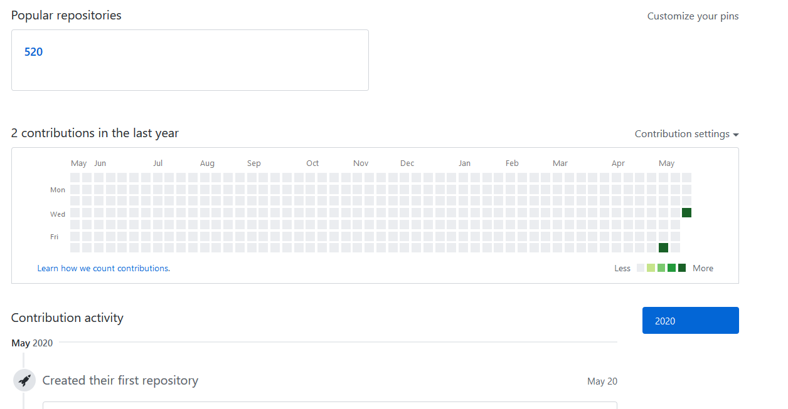

打开index.html 确保你的电脑连上了internet，因为调用了github相关的css文件。
选择第一个：

Open index.html. Make sure you connect to the internet.
Slect the first choice:

输入年份 2019 然后你会看到一个空白的contribution table：

Input year 2019 then you will see a blank contribution table:

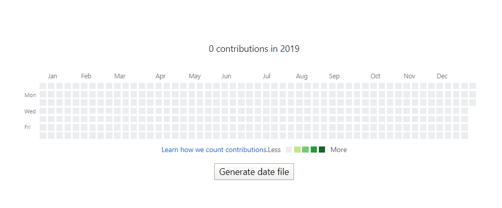

现在按照你的想法点击小方块随意画图吧，左键会增加commit num，右键会减少commit num，所有的颜色计算都与github算法相同。
如下画完图后，点击"Generate date file",将改文件保存至你的repository文件夹。

Now draw your patterns. Left click will add commit num, while right click will decrease commit num, and what you see is what you get.
Once you finish it click "Generate date file" and save it into your repository folder.

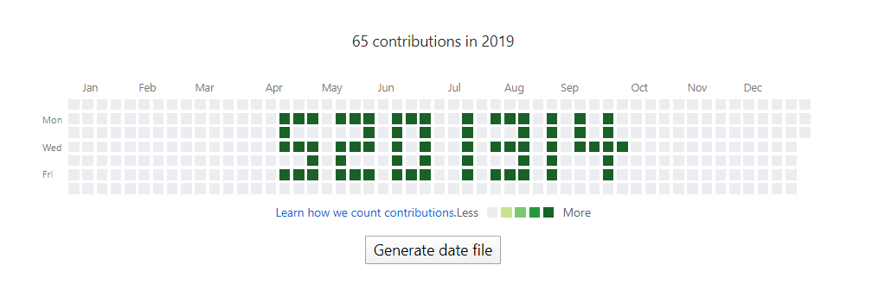

打开py文件进行设置，你只需要更改前三个选项第一个是date.txt的路径，第二个是需不需要初始化repository，第三个是初始化repository需要的git路径。
所谓的初始化，就是创建新的repository的时候什么都不创建，然后直接在本地把项目推到repository里，这样做的好处是，我可以直接把创建该repository的时间也改掉。
如果你不需要初始化，则改is_init为false：

To set the py file, you only need to change the first three options: the date.txt path, the second is whether you need to initialize repository, and the third is the Git path you need to initialize.
Initialization means you need creat a new blank Repository in github without any file(including readme.md) then the sys will pushing the project into the repository. The advantage of this is that I can change the creation time of the Repository.
If you do not need initialization, change is_init to false:

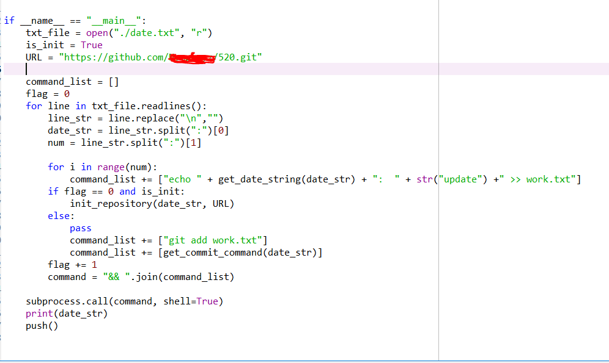

现在运行该py文件，最后你会看到你的主页已经出现了该图案：

Now run this py file, finally you can get what you want on your github contibution table.

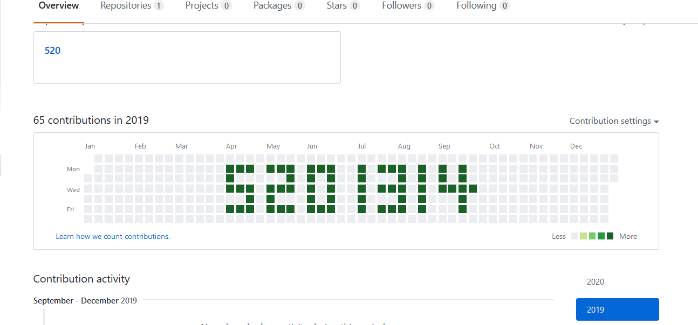

## 在已经存在页面添加图案 add patterns between any time period
如果你想在其他的任意时间段添加图案，需要从github主页copy相关的代码。
如我想在2019年原有的图案上进行修改，因此我需要copy 整一个 svg 的代码：

If you want to add patterns between any time period, you need to copy the code from the Github home page.
For example if I want to modify the pattern in 2019, I need to copy the entire SVG code from web:

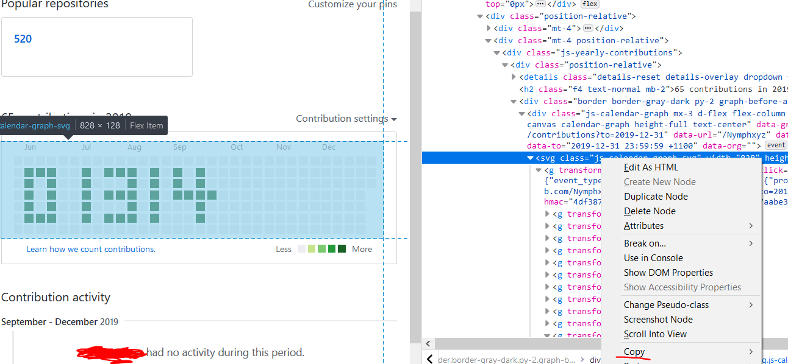

接着打开index.html选择第二个选项，将代码paste至text area：

Now open index.html and select the second choice, paste svg code into text area.

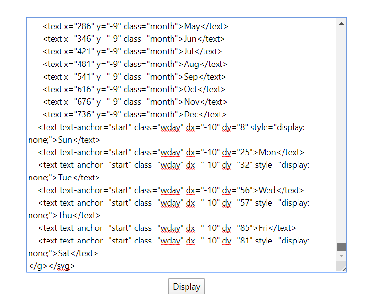

点击display，你将看到你的contribution table 已经被copy过来了：

Click display, you can see your contribution table has been copied to here.

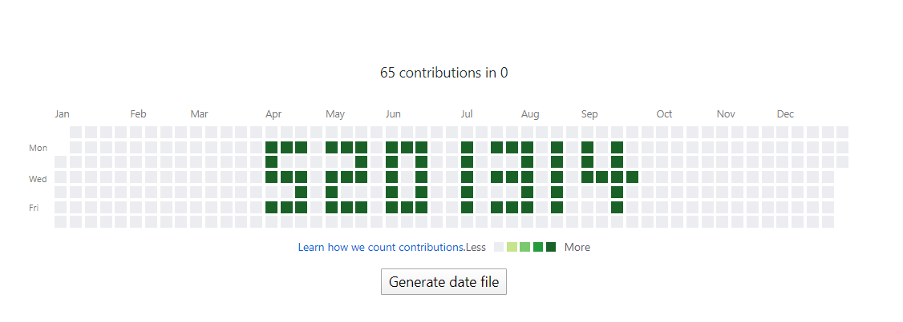

现在尽情修改吧, 但是注意对于已经存在的commit你只能添加，而不能减少它：

Now change it. However,for an existing commit you can't decrease the num of commit times.

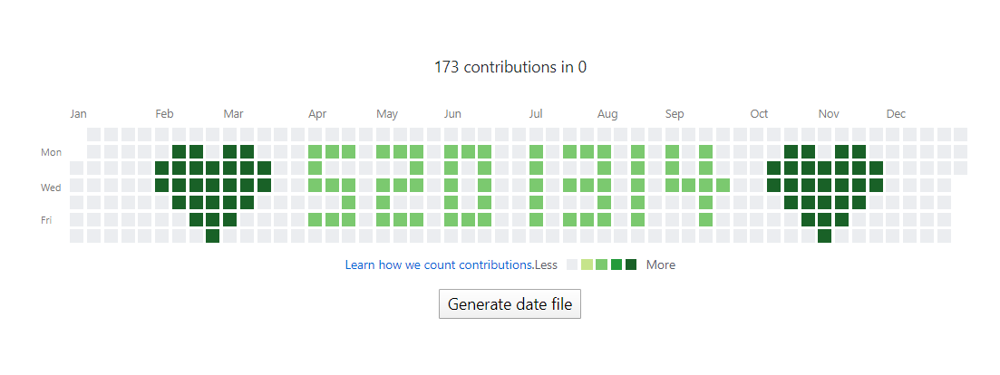

同上，运行py，现在我的主页就变成这样了：

Now run py file. See what you get:

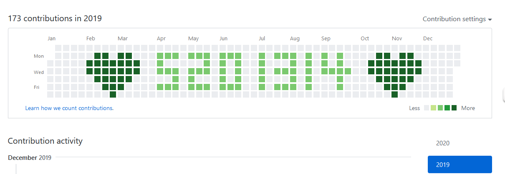

