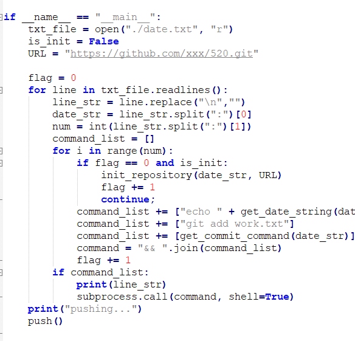

# GreenHatDecorator

感谢大佬 angusshire https://github.com/angusshire/greenhat 给我的灵感

这是一个用来装饰你的contribution table 的一个小工具。现在你可以随心所欲在contribution table上创建你想要的图案。
即便你搞砸了一切，也没关系，只需要删掉相应的repository就可以恢复如初。

包含一个py 和 基于JS 的 web.

目前只支持windows用户。
需要安装git，和环境变量。确保在cmd中可以运行git命令：

将py文件放入你的repository 文件夹！

原理是通过web定制你想要的图案，web将会生成一个date.txt
其中包含了commit的日期和commit的次数，然后使用py读取改文件，并按照文件中的日期和次数进行commit。

# 使用说明

## 在空白页面添加图案

如图现在我的contribution table没有2019年，我将会把图案写入2019年：

打开index.html 确保你的电脑连上了internet，因为调用了github相关的css文件。
选择第一个：

输入年份 2019 然后你会看到一个空白的contribution table：

现在按照你的想法点击小方块随意画图吧，左键会增加commit num，右键会减少commit num，所有的颜色计算都与github算法相同。
如下画完图后，点击"Generate date file",将改文件保存至你的repository文件夹。

打开py文件进行设置，你只需要更改前三个选项第一个是date.txt的路径，第二个是需不需要初始化repository，第三个是初始化repository需要的git路径。
所谓的初始化，就是创建新的repository的时候什么都不创建，然后直接在本地把项目推到repository里，这样做的好处是，我可以直接把创建该repository的时间也改掉。
如果你不需要初始化，则改is_init为false：

现在运行该py文件，最后你会看到你的主页已经出现了该图案：

## 在已经存在页面添加图案
如果你想在其他的任意时间段添加图案，需要从github主页copy相关的代码。
如我想在2019年原有的图案上进行修改，因此我需要copy 整一个 svg 的代码：

接着打开index.html选择第二个选项，将代码paste至text area：

点击display，你将看到你的contribution table 已经被copy过来了：

现在尽情修改吧：

同上，运行py，现在我的主页就变成这样了：

